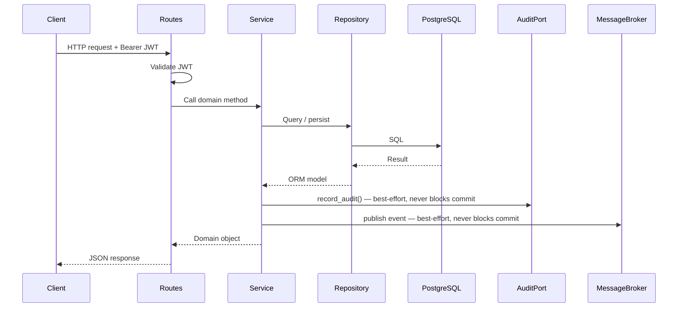
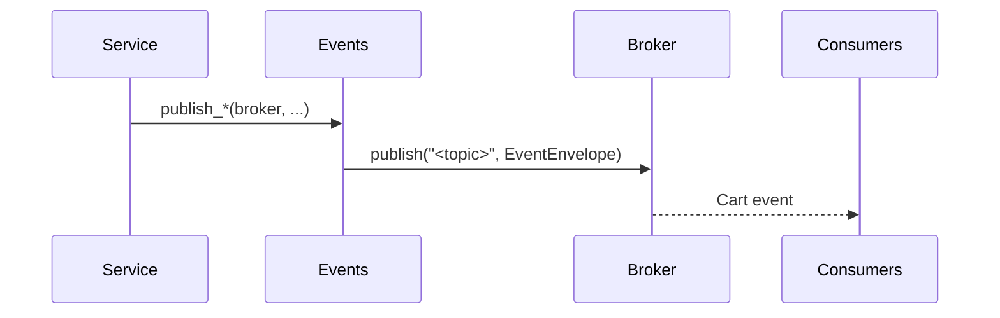
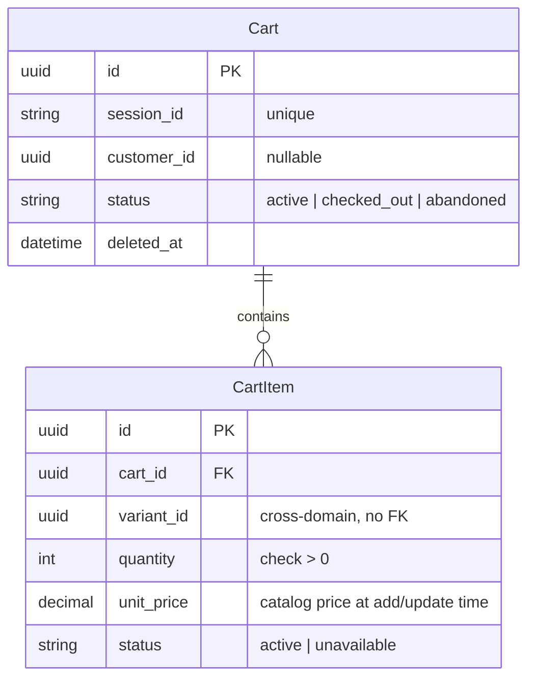

# Cart

Manages shopping carts and their line items for both anonymous and authenticated
customers. Inventory availability and catalog pricing are delegated to external
ports (`InventoryPort`, `CatalogPort`) with stub adapters until real modules exist.

## Responsibilities

- Create anonymous and authenticated carts identified by a client-supplied session token
- Claim an anonymous cart for an authenticated customer
- Merge an anonymous cart into an existing customer cart on claim
- Add, update, and remove cart item line items with live inventory and price checks
- Clear all items from a cart
- Publish domain events on every cart mutation
- Audit every state-changing operation via `AuditPort`

## Module layout

```
app/cart/
├── app.py          # Application factory
├── routes.py       # HTTP layer
├── schemas.py      # Public API contracts
├── service.py      # Domain logic
├── repository.py   # Data access layer
├── models.py       # ORM models
├── events.py       # Domain events
├── exceptions.py   # Domain-specific exceptions
├── ports.py        # Abstract ports for catalog and inventory
├── adapters.py     # Stub adapters used until real modules exist
├── migrations/     # Database migrations
└── tests/          # Test suite
```

## Request flow



## Endpoints

| Method | Path | Description |
| --- | --- | --- |
| `POST` | `/api/v1/cart` | Create or retrieve a cart for a session |
| `GET` | `/api/v1/cart/{cart_id}` | Get a cart with its items |
| `POST` | `/api/v1/cart/{cart_id}/claim` | Claim an anonymous cart for a customer |
| `POST` | `/api/v1/cart/{cart_id}/items` | Add an item to the cart |
| `PATCH` | `/api/v1/cart/{cart_id}/items/{item_id}` | Update a cart item quantity |
| `DELETE` | `/api/v1/cart/{cart_id}/items/{item_id}` | Remove a cart item permanently |
| `DELETE` | `/api/v1/cart/{cart_id}/clear` | Remove all items from the cart |

All endpoints require a valid Bearer JWT.

**Create cart** — `session_id` has a unique constraint; this endpoint is
get-or-create. Passing `customer_id` on creation binds the cart immediately
without merge semantics.

```bash
curl -X POST /api/v1/cart \
  -H "Authorization: Bearer <token>" \
  -H "Content-Type: application/json" \
  -d '{"session_id": "<session_token>", "customer_id": "<customer_uuid>"}'
```

**Claim cart** — idempotent. If the customer already has an active cart, the
anonymous cart's items are merged into it (quantities summed, prices re-read,
inventory checked) and the anonymous cart is soft-deleted.

```bash
curl -X POST /api/v1/cart/<cart_id>/claim \
  -H "Authorization: Bearer <token>" \
  -H "Content-Type: application/json" \
  -d '{"customer_id": "<customer_uuid>"}'
```

**Add item** — if the variant already exists in the cart, quantities are summed
and the unit price is refreshed from the catalog. A live inventory check is
performed before persisting.

```bash
curl -X POST /api/v1/cart/<cart_id>/items \
  -H "Authorization: Bearer <token>" \
  -H "Content-Type: application/json" \
  -d '{"variant_id": "<variant_uuid>", "quantity": 2}'
```

### Error responses

All error responses use the platform error envelope:

```json
{ "code": "<ERROR_CODE>", "message": "<description>" }
```

| Status | Code | Trigger |
| --- | --- | --- |
| `404` | `CART_NOT_FOUND` | Cart does not exist or is soft-deleted |
| `404` | `CART_ITEM_NOT_FOUND` | Cart item does not exist |
| `404` | `CART_VARIANT_NOT_FOUND` | Variant cannot be found in the catalog |
| `400` | `CART_INVALID_STATUS` | Cart is not in `active` status |
| `409` | `CART_INVENTORY_UNAVAILABLE` | Variant has insufficient stock |
| `409` | `CART_MERGE_CONFLICT` | Cart merge cannot be resolved |
| `409` | `CART_SESSION_CONFLICT` | Session already has an active cart |

## Events

| Event | Topic | Trigger |
| --- | --- | --- |
| `CartCreated` | `cart.cart.created` | New cart created |
| `CartItemAdded` | `cart.item.added` | Item added to cart |
| `CartItemUpdated` | `cart.item.updated` | Item quantity updated |
| `CartItemRemoved` | `cart.item.removed` | Item permanently removed |
| `CartCleared` | `cart.cart.cleared` | All items removed from cart |
| `CartMerged` | `cart.cart.merged` | Anonymous cart merged into customer cart |
| `CartUpdated` | `cart.cart.updated` | Coarse sync event on every cart mutation |



All events are wrapped in the platform `EventEnvelope`. Publishing is best-effort —
a broker failure logs a warning and never rolls back the domain transaction.

### CartCreated payload

| Field | Type | Description |
| --- | --- | --- |
| `session_id` | `string` | Session token for the cart |
| `customer_id` | `string \| null` | Customer UUID if bound at creation |

### CartItemAdded payload

| Field | Type | Description |
| --- | --- | --- |
| `item_id` | `string` | UUID of the cart item |
| `variant_id` | `string` | UUID of the product variant |
| `quantity` | `integer` | Quantity added |
| `unit_price` | `string` | Catalog price at time of add |

### CartItemUpdated payload

| Field | Type | Description |
| --- | --- | --- |
| `item_id` | `string` | UUID of the cart item |
| `variant_id` | `string` | UUID of the product variant |
| `quantity` | `integer` | New quantity |
| `unit_price` | `string` | Catalog price at time of update |

### CartItemRemoved payload

| Field | Type | Description |
| --- | --- | --- |
| `item_id` | `string` | UUID of the removed cart item |
| `variant_id` | `string` | UUID of the product variant |

### CartCleared payload

Empty — no fields.

### CartMerged payload

| Field | Type | Description |
| --- | --- | --- |
| `source_session_id` | `string` | Session token of the merged anonymous cart |
| `merged_count` | `integer` | Number of items merged into the customer cart |

### CartUpdated payload

| Field | Type | Description |
| --- | --- | --- |
| `mutation` | `string` | Mutation that triggered the event (`item_added`, `item_updated`, `item_removed`, `cart_cleared`, `cart_merged`, `cart_claimed`) |
| `items_count` | `integer` | Current number of items in the cart after the mutation |

Envelope fields relevant to consumers:

| Field | Value |
| --- | --- |
| `version` | `1` |
| `producer` | `cart` |
| `aggregate_type` | `cart` |
| `aggregate_id` | cart UUID |

`version` is incremented only on breaking changes. Consumers must check `event_type`
and `version` before deserializing `data`.

## Audit log

Every state-changing operation produces an audit record via `AuditPort`.
Records are written best-effort — a failure never rolls back the domain transaction.

| Operation | `action` | `operation` | `changes` |
| --- | --- | --- | --- |
| Create cart | `cart.cart_claimed` | `update` | `customer_id` before/after (if bound on create) |
| Claim cart | `cart.cart_claimed` | `update` | `customer_id` before/after |
| Merge carts | `cart.cart_merged` | `update` | `merged_from`, `merged_count` |
| Add item | `cart.item_added` | `create` | `variant_id`, `quantity`, `unit_price` |
| Update item | `cart.item_updated` | `update` | `quantity`, `unit_price` before/after |
| Remove item | `cart.item_removed` | `delete` | `item_id`, `variant_id` before/after |
| Clear cart | `cart.cart_cleared` | `delete` | `null` |

## Data model

| Table | Description |
| --- | --- |
| `commerce_cart_carts` | Shopping carts, anonymous or customer-bound |
| `commerce_cart_items` | Line items within a cart |

`Cart` supports soft delete via `deleted_at`. `CartItem` does not — items are
hard-deleted on removal. All queries exclude soft-deleted carts automatically.



## Dependencies

| Dependency | Purpose | Required |
| --- | --- | --- |
| PostgreSQL | Primary data store | Yes |
| OIDC-compliant provider | Issues JWTs validated on every request | Yes |
| `CatalogPort` | Reads current variant price | No — `StubCatalogPort` used until catalog module is wired |
| `InventoryPort` | Checks variant availability | No — `StubInventoryPort` used until inventory module is wired |
| MongoDB | Audit log store via `app/sys_audit/` | No — `NoOpAuditRepository` used when not configured |
| Message broker | Publishes cart domain events | No — `NoOpMessageBroker` used when not configured |

## Application setup

```python
from app.cart.app import create_app
from app.shared.audit_log import MongoSettings
from app.shared.auth import AuthSettings
from app.shared.db import DatabaseSettings

app = create_app(
    db_settings=DatabaseSettings(),
    auth_settings=AuthSettings(),
    mongo_settings=MongoSettings(),
)
```

Omit `mongo_settings` to use `NoOpAuditRepository`. Omit `broker` to use
`NoOpMessageBroker`. Both are suitable for tests and local development.

## Configuration

| Key | Description | Default |
| --- | --- | --- |
| `DATABASE_URL` | PostgreSQL connection string | required |
| `AUTH_JWT_PUBLIC_KEY` | PEM-encoded RSA public key for JWT validation | required |
| `AUTH_JWT_ALGORITHM` | JWT signing algorithm | `RS256` |
| `AUTH_JWT_AUDIENCE` | Expected JWT audience claim | `None` |

## Running migrations

```bash
uv run alembic -c app/cart/migrations/alembic.ini upgrade head
```

## Running tests

```bash
uv run pytest app/cart/tests/
```

Tests require a running PostgreSQL instance with a `commerce_test` database.
