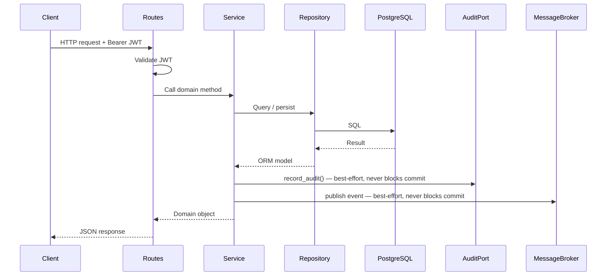
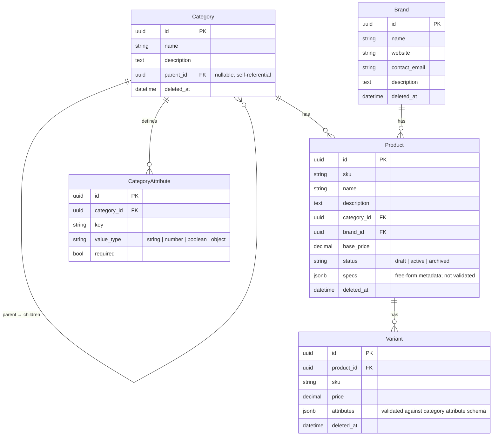

# Catalog

Manages the product catalog: categories, brands, products, variants, and category
attribute definitions. This domain owns all catalog data and business logic.

## Responsibilities

- Create and manage product categories in a hierarchical tree
- Create and manage brands
- Create and manage products with lifecycle status (draft, active, archived)
- Create and manage product variants with attribute validation
- Define and enforce category attribute schemas (including inherited attributes)
- Publish domain events on all state-changing operations

## Module layout

```
app/catalog/
├── app.py          # Application factory
├── routes.py       # HTTP layer
├── schemas.py      # Public API contracts
├── service.py      # Domain logic
├── repository.py   # Data access layer
├── models.py       # ORM models
├── events.py       # Domain events
├── exceptions.py   # Domain-specific exceptions
├── migrations/     # Database migrations
└── tests/          # Test suite
```

## Request flow



## Endpoints

### Categories

| Method | Path | Description |
| --- | --- | --- |
| `POST` | `/api/v1/catalog/categories` | Create a new category |
| `GET` | `/api/v1/catalog/categories/{id}` | Get a category |
| `PATCH` | `/api/v1/catalog/categories/{id}` | Update a category |
| `DELETE` | `/api/v1/catalog/categories/{id}` | Soft-delete a category |
| `GET` | `/api/v1/catalog/categories` | List root categories (paginated) |
| `GET` | `/api/v1/catalog/categories/{id}/children` | List direct child categories (paginated) |
| `GET` | `/api/v1/catalog/categories/{id}/products` | List products in a category (paginated) |
| `POST` | `/api/v1/catalog/categories/{id}/attributes` | Create a category attribute definition |
| `GET` | `/api/v1/catalog/categories/{id}/attributes` | List attribute definitions for a category (paginated) |
| `GET` | `/api/v1/catalog/categories/{id}/attributes/{attr_id}` | Get a category attribute |
| `PATCH` | `/api/v1/catalog/categories/{id}/attributes/{attr_id}` | Update a category attribute |
| `DELETE` | `/api/v1/catalog/categories/{id}/attributes/{attr_id}` | Delete a category attribute |

### Brands

| Method | Path | Description |
| --- | --- | --- |
| `POST` | `/api/v1/catalog/brands` | Create a new brand |
| `GET` | `/api/v1/catalog/brands/{id}` | Get a brand |
| `PATCH` | `/api/v1/catalog/brands/{id}` | Update a brand |
| `DELETE` | `/api/v1/catalog/brands/{id}` | Soft-delete a brand |
| `GET` | `/api/v1/catalog/brands/{id}/products` | List products for a brand (paginated) |

### Products

| Method | Path | Description |
| --- | --- | --- |
| `POST` | `/api/v1/catalog/products` | Create a new product |
| `GET` | `/api/v1/catalog/products/{id}` | Get a product |
| `PATCH` | `/api/v1/catalog/products/{id}` | Update a product |
| `DELETE` | `/api/v1/catalog/products/{id}` | Soft-delete a product |
| `GET` | `/api/v1/catalog/products/{id}/variants` | List variants for a product (paginated) |

### Variants

| Method | Path | Description |
| --- | --- | --- |
| `POST` | `/api/v1/catalog/products/{product_id}/variants` | Create a new variant |
| `GET` | `/api/v1/catalog/products/{product_id}/variants/{id}` | Get a variant |
| `PATCH` | `/api/v1/catalog/products/{product_id}/variants/{id}` | Update a variant |
| `DELETE` | `/api/v1/catalog/products/{product_id}/variants/{id}` | Soft-delete a variant |

All list endpoints use cursor-based pagination. Pass `?cursor=<token>` to advance to the
next page. The response includes a `next_cursor` field when more results are available.

**Create a product**

```bash
curl -X POST /api/v1/catalog/products \
  -H "Authorization: Bearer <token>" \
  -H "Content-Type: application/json" \
  -d '{
    "sku": "PROD-001",
    "name": "Example Product",
    "base_price": "29.99",
    "status": "draft",
    "category_id": "<category_uuid>",
    "brand_id": "<brand_uuid>",
    "specs": {"material": "cotton", "origin": "Portugal"}
  }'
```

**Create a variant** — `attributes` are validated against the category's declared
attribute schema, including inherited attributes from parent categories.

```bash
curl -X POST /api/v1/catalog/products/<product_id>/variants \
  -H "Authorization: Bearer <token>" \
  -H "Content-Type: application/json" \
  -d '{
    "sku": "PROD-001-RED-M",
    "price": "29.99",
    "attributes": {"color": "red", "size": "M"}
  }'
```

**Create a category attribute** — defines the schema that variant attributes must
conform to for products in this category.

```bash
curl -X POST /api/v1/catalog/categories/<category_id>/attributes \
  -H "Authorization: Bearer <token>" \
  -H "Content-Type: application/json" \
  -d '{
    "key": "color",
    "value_type": "string",
    "required": true
  }'
```

## Attribute inheritance

Category attribute schemas are inherited from parent categories. When validating a
variant's attributes, the service traverses the category hierarchy from the product's
category up to the root, collecting all attribute definitions. Child definitions take
precedence over parent definitions for the same key. Inherited attributes are resolved
in the service layer and are never denormalized in the database.

## Audit log

Every state-changing operation produces an audit record via `AuditPort` (ADR-013).
Records are written best-effort — a failure never rolls back the domain transaction.

| Operation | `action` | `operation` | `changes` |
| --- | --- | --- | --- |
| Create category | `catalog.category_created` | `create` | `before: null, after: <value>` per field |
| Update category | `catalog.category_updated` | `update` | before/after per changed field |
| Delete category | `catalog.category_deleted` | `delete` | `null` |
| Create brand | `catalog.brand_created` | `create` | `before: null, after: <value>` per field |
| Update brand | `catalog.brand_updated` | `update` | before/after per changed field |
| Delete brand | `catalog.brand_deleted` | `delete` | `null` |
| Create product | `catalog.product_created` | `create` | `before: null, after: <value>` per field |
| Update product | `catalog.product_updated` | `update` | before/after per changed field |
| Delete product | `catalog.product_deleted` | `delete` | `null` |
| Create variant | `catalog.variant_created` | `create` | `before: null, after: <value>` per field |
| Update variant | `catalog.variant_updated` | `update` | before/after per changed field |
| Delete variant | `catalog.variant_deleted` | `delete` | `null` |
| Create category attribute | `catalog.category_attribute_created` | `create` | `before: null, after: <value>` per field |
| Update category attribute | `catalog.category_attribute_updated` | `update` | before/after per changed field |
| Delete category attribute | `catalog.category_attribute_deleted` | `delete` | `null` |

### Error responses

All error responses use the platform error envelope:

```json
{ "code": "<ERROR_CODE>", "message": "<description>" }
```

| Status | Code | Trigger |
| --- | --- | --- |
| `404` | `CATEGORY_NOT_FOUND` | Category does not exist or is soft-deleted |
| `409` | `CATEGORY_ALREADY_EXISTS` | Category name already exists under the same parent |
| `404` | `BRAND_NOT_FOUND` | Brand does not exist or is soft-deleted |
| `409` | `BRAND_ALREADY_EXISTS` | Brand name is already taken |
| `404` | `PRODUCT_NOT_FOUND` | Product does not exist or is soft-deleted |
| `409` | `PRODUCT_ALREADY_EXISTS` | Product SKU is already taken |
| `404` | `VARIANT_NOT_FOUND` | Variant does not exist or is soft-deleted |
| `409` | `VARIANT_ALREADY_EXISTS` | Variant SKU is already taken |
| `404` | `CATEGORY_ATTRIBUTE_NOT_FOUND` | Category attribute does not exist |
| `409` | `CATEGORY_ATTRIBUTE_ALREADY_EXISTS` | Attribute key already exists for the category |
| `400` | `INVALID_VARIANT_ATTRIBUTES` | Variant attributes fail the category schema validation |

## Events

| Event | Topic | Trigger |
| --- | --- | --- |
| `CategoryCreated` | `catalog.category.created` | New category created |
| `CategoryUpdated` | `catalog.category.updated` | Category updated |
| `CategoryDeleted` | `catalog.category.deleted` | Category soft-deleted |
| `BrandCreated` | `catalog.brand.created` | New brand created |
| `BrandUpdated` | `catalog.brand.updated` | Brand updated |
| `BrandDeleted` | `catalog.brand.deleted` | Brand soft-deleted |
| `ProductCreated` | `catalog.product.created` | New product created |
| `ProductUpdated` | `catalog.product.updated` | Product updated |
| `ProductDeleted` | `catalog.product.deleted` | Product soft-deleted |
| `VariantCreated` | `catalog.variant.created` | New variant created |
| `VariantUpdated` | `catalog.variant.updated` | Variant updated |
| `VariantDeleted` | `catalog.variant.deleted` | Variant soft-deleted |
| `CategoryAttributeCreated` | `catalog.category_attribute.created` | New attribute definition created |
| `CategoryAttributeUpdated` | `catalog.category_attribute.updated` | Attribute definition updated |
| `CategoryAttributeDeleted` | `catalog.category_attribute.deleted` | Attribute definition deleted |

All events are wrapped in the platform `EventEnvelope`. Event publishing is best-effort —
a broker failure logs a warning and never rolls back the domain transaction.

Envelope fields relevant to consumers:

| Field | Value |
| --- | --- |
| `version` | `1` |
| `producer` | `catalog` |
| `aggregate_type` | entity name (e.g. `product`, `variant`) |
| `aggregate_id` | entity UUID |

`version` is incremented only on breaking changes. Consumers must check `event_type`
and `version` before deserializing `data`.

## Data model

| Table | Description |
| --- | --- |
| `catalog_categories` | Product categories in a self-referential hierarchy |
| `catalog_brands` | Manufacturers and brands |
| `catalog_products` | Sellable products |
| `catalog_variants` | Sellable variants of a product |
| `catalog_category_attributes` | Attribute schema definitions per category |

`Category`, `Brand`, `Product`, and `Variant` support soft delete via `deleted_at`.
All queries exclude soft-deleted records automatically. `CategoryAttribute` does not
support soft delete — the row is removed on delete.



## Dependencies

| Dependency | Purpose | Required |
| --- | --- | --- |
| PostgreSQL | Primary data store | Yes |
| OIDC-compliant provider | Issues JWTs validated on every request | Yes |
| MongoDB | Audit log store via `app/sys_audit/` | No — `NoOpAuditRepository` used when not configured |
| Message broker | Publishes catalog domain events | No — events are skipped if broker is unavailable |

## Application setup

```python
from app.catalog.app import create_app
from app.shared.audit_log import MongoSettings
from app.shared.auth import AuthSettings
from app.shared.db import DatabaseSettings

app = create_app(
    db_settings=DatabaseSettings(),
    auth_settings=AuthSettings(),
    mongo_settings=MongoSettings(),
)
```

Omit `mongo_settings` in tests or environments without MongoDB — a `NoOpAuditRepository`
is used automatically. Omit `broker` to use a no-op broker.

## Configuration

| Key | Description | Default |
| --- | --- | --- |
| `DATABASE_URL` | PostgreSQL connection string | required |
| `AUTH_JWT_PUBLIC_KEY` | PEM-encoded RSA public key for JWT validation | required |
| `AUTH_JWT_ALGORITHM` | JWT signing algorithm | `RS256` |
| `AUTH_JWT_AUDIENCE` | Expected JWT audience claim | `None` |

## Running migrations

```bash
uv run alembic -c app/catalog/migrations/alembic.ini upgrade head
```

## Running tests

```bash
uv run pytest app/catalog/tests/
```

Tests require a running PostgreSQL instance with a `commerce_test` database.
