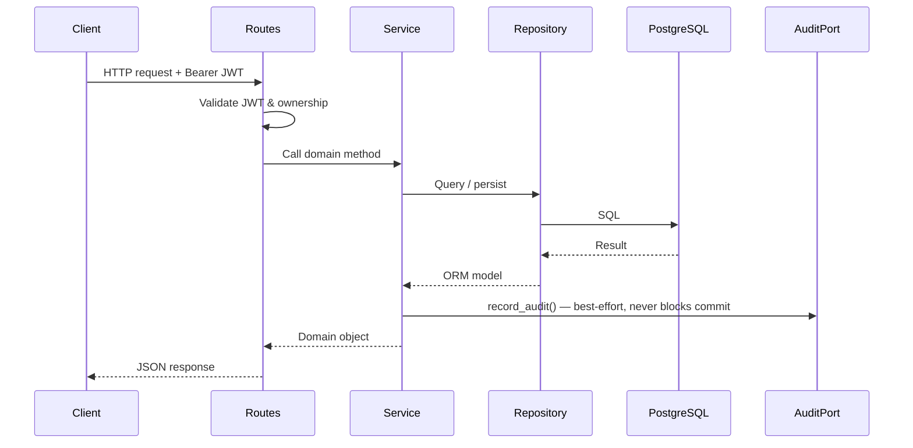
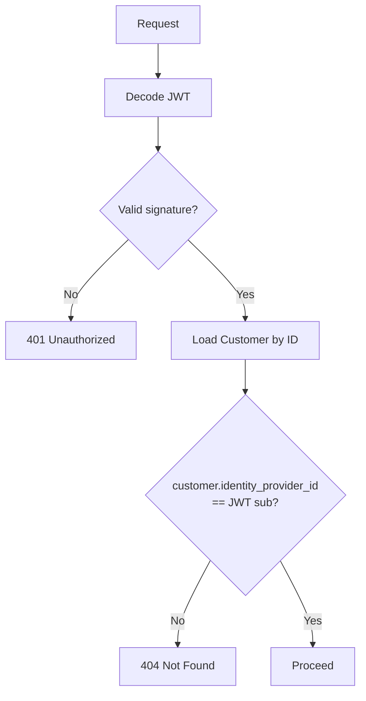
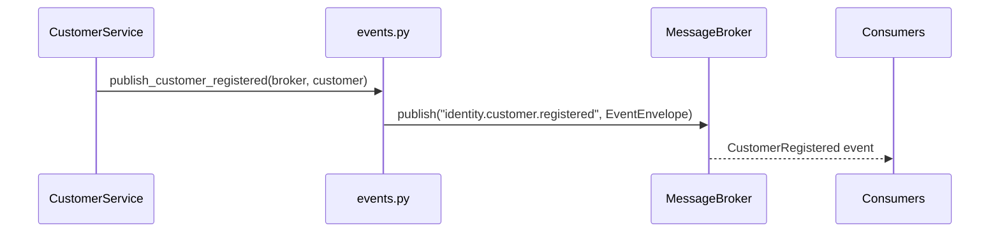
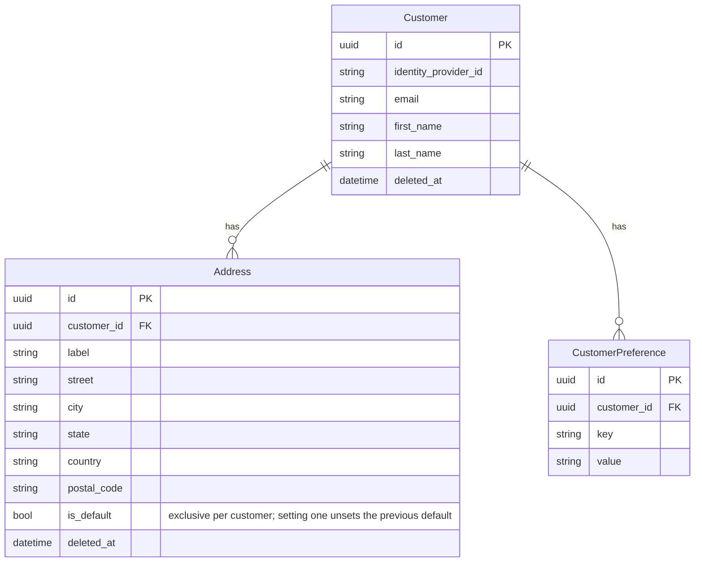

# Identity

Manages customer profiles and addresses. Authentication is delegated to an external
identity provider (e.g. Keycloak). This domain owns domain-specific customer data
linked to the provider via the JWT `sub` claim.

## Responsibilities

- Register customer profiles on first login
- Store and update customer profile data (name, email)
- Manage customer addresses
- Manage customer preferences (key-value store)
- Publish `CustomerRegistered` events on new registrations

## Module layout

```
app/identity/
├── app.py          # Application factory
├── routes.py       # HTTP layer
├── schemas.py      # Public API contracts
├── service.py      # Domain logic
├── repository.py   # Data access layer
├── models.py       # ORM models
├── events.py       # Domain events
├── exceptions.py   # Domain-specific exceptions
├── migrations/     # Database migrations
└── tests/          # Test suite
```

## Request flow



## Endpoints

| Method | Path | Description |
| --- | --- | --- |
| `POST` | `/api/v1/customers` | Register a new customer profile |
| `GET` | `/api/v1/customers/{id}` | Get a customer profile |
| `PATCH` | `/api/v1/customers/{id}` | Update a customer profile |
| `DELETE` | `/api/v1/customers/{id}` | Soft-delete a customer profile |
| `PATCH` | `/api/v1/customers/{id}/preferences` | Upsert customer preferences |
| `GET` | `/api/v1/customers/{id}/addresses` | List customer addresses |
| `POST` | `/api/v1/customers/{id}/addresses` | Add a new address |
| `PATCH` | `/api/v1/customers/{id}/addresses/{addr_id}` | Update an address |
| `DELETE` | `/api/v1/customers/{id}/addresses/{addr_id}` | Soft-delete an address |

All endpoints require a valid Bearer JWT. Ownership is enforced on every request —
a customer can only access their own profile and addresses.

**Register a customer** — `identity_provider_id` must match the `sub` claim from the JWT.

```bash
curl -X POST /api/v1/customers \
  -H "Authorization: Bearer <token>" \
  -H "Content-Type: application/json" \
  -d '{
    "identity_provider_id": "auth0|<sub>",
    "email": "<email>",
    "first_name": "<first_name>",
    "last_name": "<last_name>"
  }'
```

**Add an address** — `is_default: true` marks it as the customer's default shipping address. If another address is already the default, it is automatically unset. Only one default address can exist per customer at a time.

```bash
curl -X POST /api/v1/customers/<id>/addresses \
  -H "Authorization: Bearer <token>" \
  -H "Content-Type: application/json" \
  -d '{
    "label": "Home",
    "street": "<street>",
    "city": "<city>",
    "state": "<state>",
    "country": "<country>",
    "postal_code": "<postal_code>",
    "is_default": true
  }'
```

**Upsert preferences** — only keys present in the request are affected; existing keys not included are left unchanged. Keys must be in the allowed list defined in `allowed_preferences.json`; private keys cannot be set via this endpoint.

```bash
curl -X PATCH /api/v1/customers/<id>/preferences \
  -H "Authorization: Bearer <token>" \
  -H "Content-Type: application/json" \
  -d '{
    "preferences": {
      "language": "en",
      "timezone": "UTC",
      "whatsapp_enabled": "true"
    }
  }'
```

**Allowed preference keys** — defined in `allowed_preferences.json`. Private keys are reserved for internal use and cannot be set via the API.

| Key | Type | Allowed values |
| --- | --- | --- |
| `language` | string | `en`, `es`, `fr` |
| `timezone` | string | any IANA timezone string |
| `whatsapp_enabled` | boolean | `true`, `false` |
| `email_notifications_enabled` | boolean | `true`, `false` |
| `sms_notifications_enabled` | boolean | `true`, `false` |

## Audit log

Every state-changing operation produces an audit record via `AuditPort` (ADR-013).
Records are written best-effort — a failure never rolls back the domain transaction.

| Operation | `action` | `operation` | `changes` |
| --- | --- | --- | --- |
| `update_profile` | `customer.profile_updated` | `update` | before/after per changed field |
| `add_address` | `customer.address_created` | `create` | `before: null, after: <value>` per field |
| `update_address` | `customer.address_updated` | `update` | before/after per changed field |
| `remove_address` | `customer.address_deleted` | `delete` | `null` |
| `update_preferences` | `customer.preferences_updated` | `update` | before/after per changed key |

`register` is excluded — covered by the `CustomerRegistered` domain event.
`add_address` is idempotent on `(customer_id, label)` — no audit record is produced when an existing address is returned unchanged.

### Error responses

All error responses use the platform error envelope:

```json
{ "code": "<ERROR_CODE>", "message": "<description>" }
```

| Status | Code | Trigger |
| --- | --- | --- |
| `400` | `INVALID_PREFERENCE_KEY` | One or more preference keys are unknown or private |
| `401` | — | Missing or invalid JWT |
| `404` | `CUSTOMER_NOT_FOUND` | Customer does not exist, is soft-deleted, or caller does not own it |
| `404` | `ADDRESS_NOT_FOUND` | Address does not exist or is soft-deleted |
| `409` | `CUSTOMER_ALREADY_EXISTS` | `identity_provider_id` is already registered |

## Authorization

Ownership is checked by matching the JWT `sub` claim against `Customer.identity_provider_id`.
A mismatch returns `404` (not `403`) to avoid leaking resource existence to unauthorized callers.



## Events

| Event | Topic | Trigger |
| --- | --- | --- |
| `CustomerRegistered` | `identity.customer.registered` | New customer profile created |



### CustomerRegistered payload

All events are wrapped in the platform `EventEnvelope`. The `data` field for this event is:

| Field | Type | Description |
| --- | --- | --- |
| `customer_id` | `uuid` | Internal customer identifier |
| `identity_provider_id` | `string` | JWT `sub` claim from the identity provider |
| `email` | `string` | Customer email at registration time |
| `first_name` | `string` | Customer given name |
| `last_name` | `string` | Customer family name |

Envelope fields relevant to consumers:

| Field | Value |
| --- | --- |
| `event_type` | `CustomerRegistered` |
| `version` | `1` |
| `producer` | `identity` |
| `aggregate_type` | `customer` |
| `aggregate_id` | customer UUID |

`version` is incremented only on breaking changes. Consumers must check `event_type` and `version` before deserializing `data`.

## Data model

| Table | Description |
| --- | --- |
| `identity_customers` | Customer profiles linked to the identity provider |
| `identity_customer_addresses` | Physical addresses per customer |
| `identity_customer_preferences` | Key-value preferences per customer |

`Customer` and `Address` support soft delete via `deleted_at`. All queries exclude
soft-deleted records automatically.



## Dependencies

| Dependency | Purpose | Required |
| --- | --- | --- |
| PostgreSQL | Primary data store | Yes |
| Keycloak (or any OIDC provider) | Issues JWTs validated on every request | Yes |
| MongoDB | Audit log store via `app/sys_audit/` | No — `NoOpAuditRepository` used when not configured |
| Message broker | Publishes `CustomerRegistered` events | No — registration succeeds even if publish fails |

## Application setup

```python
from app.identity.app import create_app
from app.shared.audit_log import MongoSettings
from app.shared.auth import AuthSettings
from app.shared.db import DatabaseSettings

app = create_app(
    db_settings=DatabaseSettings(),
    auth_settings=AuthSettings(),
    mongo_settings=MongoSettings(),
)
```

Omit `mongo_settings` in tests or environments without MongoDB — a `NoOpAuditRepository`
is used automatically.

## Configuration

| Key | Description | Default |
| --- | --- | --- |
| `DATABASE_URL` | PostgreSQL connection string | required |
| `AUTH_JWT_PUBLIC_KEY` | PEM-encoded RSA public key for JWT validation | required |
| `AUTH_JWT_ALGORITHM` | JWT signing algorithm | `RS256` |
| `AUTH_JWT_AUDIENCE` | Expected JWT audience claim | `None` |

## Running migrations

```bash
uv run alembic -c app/identity/migrations/alembic.ini upgrade head
```

## Running tests

```bash
uv run pytest app/identity/tests/
```

Tests require a running PostgreSQL instance with a `commerce_test` database.
