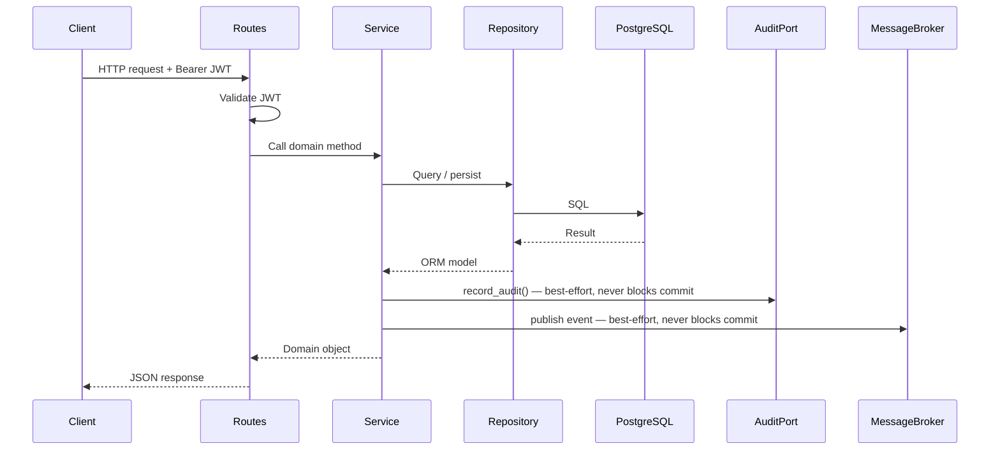
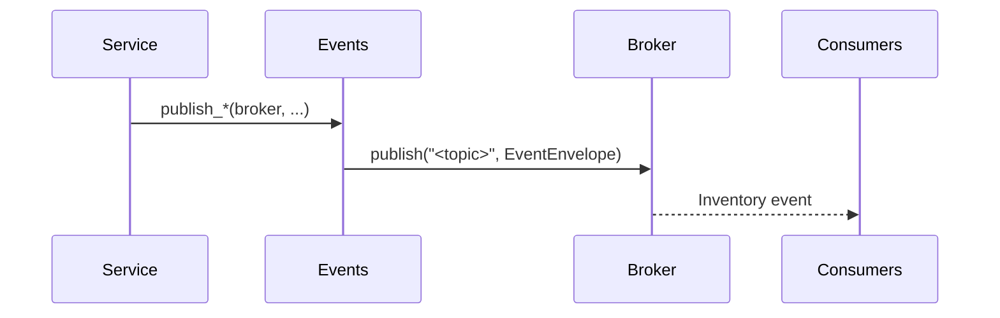
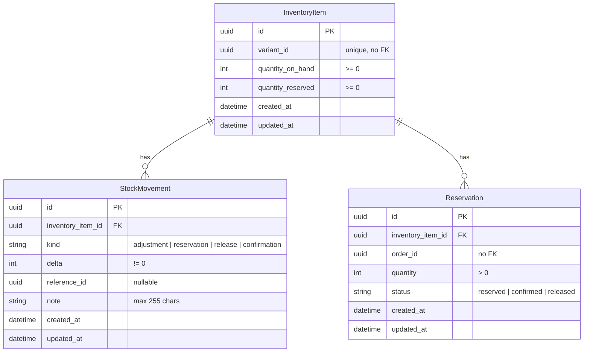

# Inventory

Tracks stock quantities and reservations per product variant for the commerce
platform. Catalog lookups are out of scope; the catalog domain owns product and
variant definitions. Pricing and order finalization are also delegated to their
respective domains.

## Responsibilities

- Create and maintain tracked inventory items with an initial stock quantity
- Adjust stock quantities with append-only audit trail
- Reserve stock for orders with idempotent reservation semantics
- Confirm reservations on payment success, decrementing both reserved and on-hand quantities
- Release reservations on payment failure, returning units to available stock
- Publish domain events on every reservation state change
- Audit every state-changing operation via `AuditPort`

## Module layout

```
app/inventory/
├── app.py          # Application factory
├── routes.py       # HTTP layer
├── schemas.py      # Public API contracts
├── service.py      # Domain logic
├── repository.py   # Data access layer
├── models.py       # ORM models
├── events.py       # Domain events
├── exceptions.py   # Domain-specific exceptions
├── migrations/     # Database migrations
└── tests/          # Test suite
```

## Request flow



## Endpoints

| Method | Path | Description |
| --- | --- | --- |
| `POST` | `/api/v1/inventory/items` | Create a tracked inventory item |
| `GET` | `/api/v1/inventory/items/{variant_id}` | Get inventory item with stock levels |
| `POST` | `/api/v1/inventory/items/{variant_id}/adjust` | Adjust stock quantity by delta |
| `POST` | `/api/v1/inventory/reservations` | Reserve stock for an order |
| `POST` | `/api/v1/inventory/reservations/{reservation_id}/release` | Release a reservation |
| `POST` | `/api/v1/inventory/reservations/{reservation_id}/confirm` | Confirm a reservation |

All endpoints require a valid Bearer JWT.

### Error responses

All error responses use the platform error envelope:

```json
{ "code": "<ERROR_CODE>", "message": "<description>" }
```

| Status | Code | Trigger |
| --- | --- | --- |
| `404` | `INVENTORY_ITEM_NOT_FOUND` | Variant does not have a tracked inventory item |
| `404` | `INVENTORY_RESERVATION_NOT_FOUND` | Reservation does not exist |
| `409` | `INVENTORY_ITEM_ALREADY_EXISTS` | Inventory item already exists for the variant |
| `409` | `INVENTORY_INSUFFICIENT_STOCK` | Not enough stock to fulfill the request |
| `400` | `INVENTORY_INVALID_RESERVATION_TRANSITION` | Reservation transition is not allowed |

## Events

| Event | Topic | Trigger |
| --- | --- | --- |
| `InventoryReserved` | `inventory.stock.reserved` | Stock reserved for an order |
| `InventoryReleased` | `inventory.stock.released` | Reservation released |
| `InventoryConfirmed` | `inventory.stock.confirmed` | Reservation confirmed on payment |



All events are wrapped in the platform `EventEnvelope`. Publishing is best-effort —
a broker failure logs a warning and never rolls back the domain transaction.

### InventoryReserved payload

| Field | Type | Description |
| --- | --- | --- |
| `reservation_id` | `string` | UUID of the reservation |
| `variant_id` | `string` | UUID of the product variant |
| `order_id` | `string` | UUID of the order |
| `quantity` | `integer` | Quantity reserved |

### InventoryReleased payload

| Field | Type | Description |
| --- | --- | --- |
| `reservation_id` | `string` | UUID of the reservation |
| `variant_id` | `string` | UUID of the product variant |
| `order_id` | `string` | UUID of the order |
| `quantity` | `integer` | Quantity released |

### InventoryConfirmed payload

| Field | Type | Description |
| --- | --- | --- |
| `reservation_id` | `string` | UUID of the reservation |
| `variant_id` | `string` | UUID of the product variant |
| `order_id` | `string` | UUID of the order |
| `quantity` | `integer` | Quantity confirmed |

Envelope fields relevant to consumers:

| Field | Value |
| --- | --- |
| `event_type` | `InventoryReserved`, `InventoryReleased`, or `InventoryConfirmed` |
| `version` | `1` |
| `producer` | `inventory` |
| `aggregate_type` | `inventory_item` |
| `aggregate_id` | variant UUID |

`version` is incremented only on breaking changes. Consumers must check `event_type`
and `version` before deserializing `data`.

## Data model

| Table | Description |
| --- | --- |
| `inventory_items` | Tracked stock quantities per product variant |
| `inventory_movements` | Append-only audit trail of stock changes |
| `inventory_reservations` | Order reservations with lifecycle status |



`InventoryItem` quantities are protected by check constraints and must never be
negative. `Reservation` enforces one reservation per `(inventory_item_id, order_id)`
at the database level. `StockMovement` is append-only and is never deleted.

## Dependencies

| Dependency | Purpose | Required |
| --- | --- | --- |
| PostgreSQL | Primary data store | Yes |
| OIDC-compliant provider | Issues JWTs validated on every request | Yes |
| MongoDB | Audit log store via `app/sys_audit/` | No — `NoOpAuditRepository` used when not configured |
| Message broker | Publishes inventory domain events | No — `NoOpMessageBroker` used when not configured |

## Application setup

```python
from app.inventory.app import create_app
from app.shared.audit_log import MongoSettings
from app.shared.auth import AuthSettings
from app.shared.db import DatabaseSettings

app = create_app(
    db_settings=DatabaseSettings(),
    auth_settings=AuthSettings(),
    mongo_settings=MongoSettings(),
)
```

Omit `mongo_settings` to use `NoOpAuditRepository`. Omit `broker` to use
`NoOpMessageBroker`. Both are suitable for tests and local development.

## Configuration

| Key | Description | Default |
| --- | --- | --- |
| `DATABASE_URL` | PostgreSQL connection string | required |
| `AUTH_JWT_PUBLIC_KEY` | PEM-encoded RSA public key for JWT validation | required |
| `AUTH_JWT_ALGORITHM` | JWT signing algorithm | `RS256` |
| `AUTH_JWT_AUDIENCE` | Expected JWT audience claim | `None` |

## Running migrations

```bash
uv run alembic -c app/inventory/migrations/alembic.ini upgrade head
```

## Running tests

```bash
uv run pytest app/inventory/tests/
```

Tests require a running PostgreSQL instance with a `commerce_test` database.