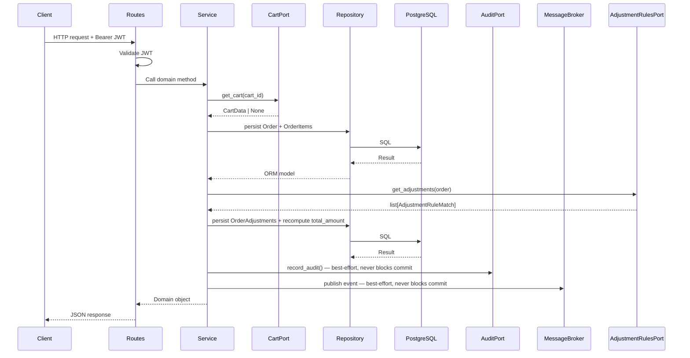
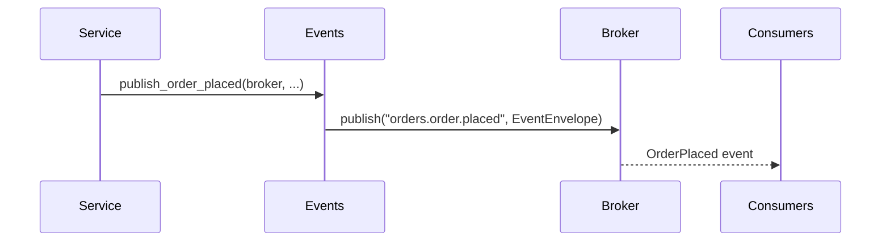
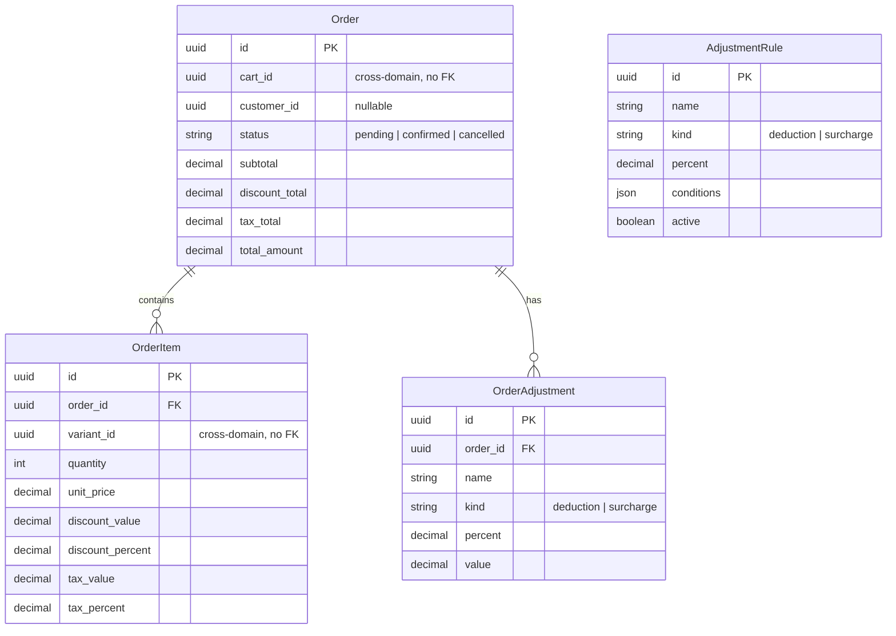

# Orders

Manages order creation and retrieval from cart checkouts. Cart data is read
via `CartPort` and adjustment rules are evaluated via `AdjustmentRulesPort` —
both are injected at startup and default to stubs until real implementations
are wired.

## Responsibilities

- Create an order by snapshotting an active cart at checkout time
- Validate that the cart exists, is active, and has at least one item
- Snapshot item prices, discounts, and taxes from the cart — catalog is never re-read
- Compute order totals (subtotal, discount total, tax total, final amount)
- Evaluate active adjustment rules automatically at checkout and apply them to the order
- Recompute `total_amount` to include all deductions and surcharges
- Publish a domain event on every successful order placement
- Audit every order creation via `AuditPort`

## Module layout

```
app/orders/
├── app.py          # Application factory
├── routes.py       # HTTP layer
├── schemas.py      # Public API contracts
├── service.py      # Domain logic
├── repository.py   # Data access layer
├── models.py       # ORM models
├── events.py       # Domain events
├── exceptions.py   # Domain-specific exceptions
├── ports.py        # Contracts for external dependencies
├── adapters.py     # Fallback implementations for external dependencies
├── migrations/     # Database schema versioning
└── tests/          # Test suite
```

## Request flow



## Service details

### Order total calculation

All values are snapshotted from the cart at checkout time. The service never
reads from the catalog.

| Field | Formula |
| --- | --- |
| `subtotal` | `sum(unit_price × quantity)` for all items |
| `discount_total` | `sum(discount_value)` for all items |
| `tax_total` | `sum(tax_value)` for all items |
| `total_amount` | `subtotal - discount_total + tax_total - sum(deductions) + sum(surcharges)` |

Order-level adjustments (`OrderAdjustment`) are applied after order creation
and are not included in `total_amount` at placement time.

### Order adjustments

Adjustment rules are stored in `commerce_orders_adjustment_rules` and evaluated
automatically during `place_order`. The `AdjustmentRulesPort` loads all active
rules, evaluates their `conditions` against the full order, and returns the
matching adjustments with pre-computed values.

| Field | Description |
| --- | --- |
| `name` | Human-readable label (e.g. `reteiva`, `reteica`) |
| `kind` | `deduction` reduces the payable total; `surcharge` increases it |
| `percent` | Rate used to compute the adjustment value (0–100) |
| `value` | Computed amount snapshotted at the time of application |

`total_amount` on `Order` is always the final payable amount — it is recomputed
after adjustments are persisted and reflects:

```
total_amount = subtotal - discount_total + tax_total
             - sum(value for adjustments where kind = "deduction")
             + sum(value for adjustments where kind = "surcharge")
```

## Endpoints

| Method | Path | Description |
| --- | --- | --- |
| `POST` | `/api/v1/orders` | Place an order from an active cart checkout |
| `GET` | `/api/v1/orders/{order_id}` | Get an order with its items and adjustments |

All endpoints require a valid Bearer JWT.

**Place order** — creates an order by snapshotting the cart identified by
`cart_id`. The cart must be `active` and contain at least one item. Prices,
discounts, and taxes are copied from the cart at the moment of checkout — no
catalog re-read occurs.

```bash
curl -X POST /api/v1/orders \
  -H "Authorization: Bearer <token>" \
  -H "Content-Type: application/json" \
  -d '{"cart_id": "<cart_uuid>"}'
```

### Error responses

All error responses use the platform error envelope:

```json
{ "code": "<ERROR_CODE>", "message": "<description>" }
```

| Status | Code | Trigger |
| --- | --- | --- |
| `404` | `ORDER_NOT_FOUND` | Order does not exist |
| `400` | `ORDER_CART_INVALID_REFERENCE` | Cart port returned no cart for the given `cart_id` |
| `400` | `ORDER_CART_NOT_ELIGIBLE` | Cart is not in `active` status |
| `400` | `ORDER_CART_HAS_NO_ITEMS` | Cart has no items to check out |

## Events

| Event | Topic | Trigger |
| --- | --- | --- |
| `OrderPlaced` | `orders.order.placed` | Order successfully created |



Publishing is best-effort — a broker failure logs a warning and never rolls
back the domain transaction.

### OrderPlaced payload

| Field | Type | Description |
| --- | --- | --- |
| `order_id` | `string` | UUID of the newly created order |
| `cart_id` | `string` | UUID of the cart that was checked out |
| `customer_id` | `string \| null` | UUID of the customer, if authenticated |
| `total_amount` | `string` | Final payable amount including all adjustments, as a decimal string |
| `items_count` | `integer` | Number of line items in the order |

Envelope fields relevant to consumers:

| Field | Value |
| --- | --- |
| `event_type` | `OrderPlaced` |
| `version` | `1` |
| `producer` | `orders` |
| `aggregate_type` | `order` |
| `aggregate_id` | order UUID |

`version` is incremented only on breaking changes. Consumers must check
`event_type` and `version` before deserializing `data`.

## Data model

| Table | Description |
| --- | --- |
| `commerce_orders_orders` | Orders created from cart checkouts |
| `commerce_orders_items` | Snapshotted line items within an order |
| `commerce_orders_adjustments` | Order-level financial adjustments computed at checkout |
| `commerce_orders_adjustment_rules` | Configurable rules used to compute order adjustments |

`Order`, `OrderItem`, `OrderAdjustment`, and `AdjustmentRule` do not support
soft delete — records are permanent once created.



## Dependencies

| Dependency | Purpose | Required |
| --- | --- | --- |
| PostgreSQL | Primary data store | Yes |
| OIDC-compliant provider | Issues JWTs validated on every request | Yes |
| `CartPort` | Reads cart data during checkout | No — `StubCartPort` used until cart module is wired |
| `AdjustmentRulesPort` | Evaluates adjustment rules at checkout | No — `StubAdjustmentRulesPort` returns no adjustments until wired |
| MongoDB | Audit log store via `app/sys_audit/` | No — `NoOpAuditRepository` used when not configured |
| Message broker | Publishes order domain events | No — `NoOpMessageBroker` used when not configured |

## Application setup

```python
from app.orders.app import create_app
from app.shared.audit_log import MongoSettings
from app.shared.auth import AuthSettings
from app.shared.db import DatabaseSettings

app = create_app(
    db_settings=DatabaseSettings(),
    auth_settings=AuthSettings(),
    mongo_settings=MongoSettings(),
)
```

Omit `mongo_settings` to use `NoOpAuditRepository`. Omit `broker` to use
`NoOpMessageBroker`. Omit `cart_port` to use `StubCartPort`. Omit
`adjustment_rules_port` to use `StubAdjustmentRulesPort`. All are suitable
for tests and local development.

## Configuration

| Key | Description | Default |
| --- | --- | --- |
| `DATABASE_BASE_URL` | PostgreSQL base connection string (without database name) | required |
| `AUTH_JWT_PUBLIC_KEY` | PEM-encoded RSA public key for JWT validation | required |
| `AUTH_JWT_ALGORITHM` | JWT signing algorithm | `RS256` |
| `AUTH_JWT_AUDIENCE` | Expected JWT audience claim | `None` |

## Running migrations

```bash
uv run alembic -c app/orders/migrations/alembic.ini upgrade head
```

## Running tests

```bash
uv run pytest app/orders/tests/
```

Tests require a running PostgreSQL instance with a `commerce_test` database.
