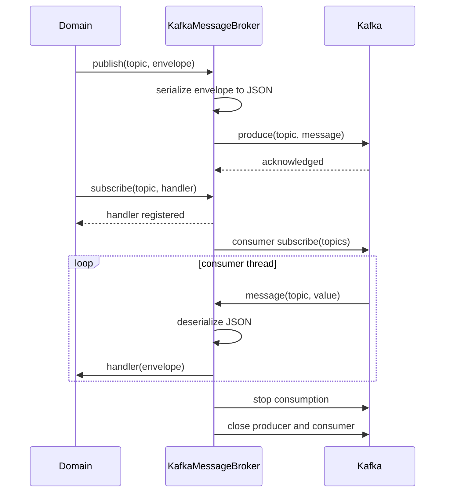

# sys_eventbus

Platform event bus module. Concrete implementations of the `MessageBroker` abstract
port defined in `app/shared/events/`.

This module owns the concrete event bus implementations. Domain modules must never
import from here directly — they depend only on `app/shared/events/` (ADR-001,
ADR-004). The concrete event bus is wired at the application level in each domain's
`app.py`.

## Module layout

```
app/sys_eventbus/
├── __init__.py         # Public exports for the platform event bus
├── brokers.py          # Concrete event bus implementations
├── factory.py          # resolve_broker() factory
├── README.md           # Module documentation
└── settings.py         # Event bus configuration via Pydantic Settings
```

## Responsibility

Owns the concrete event bus implementations and their configuration. No business
logic belongs here — domain events are published and consumed through the
`MessageBroker` port only.

## How it works

Each event bus implementation receives an `EventEnvelope` from a domain service via
`publish()` and forwards it to the configured event bus. Subscriptions are
registered via `subscribe()` and handled by a background consumer thread started
in `start()`.

EventBusSettings declares the event bus configuration keys as Pydantic Settings
fields. Missing or invalid values raise a `ValidationError` at startup before the
application serves any traffic (ADR-015).

## Brokers

### Kafka

The current concrete implementation is Kafka. Publishing and consuming follow this
flow:

1. `KafkaMessageBroker.publish(topic, envelope)` serializes the envelope to JSON
   UTF-8 and sends it to the configured Kafka topic.
2. `KafkaMessageBroker.subscribe(topic, handler)` registers a handler for the
   topic.
3. `KafkaMessageBroker.start()` creates the Kafka producer and consumer, then
   starts the consumer loop in a background thread.
4. The consumer loop receives messages from Kafka, deserializes the JSON
   envelope, and invokes the registered handler.
5. `KafkaMessageBroker.stop()` signals the consumer thread to drain, waits for
   it to finish, and closes the Kafka connections.



## Wiring

Use `resolve_broker()` in the domain's `app.py` lifespan. It reads
`KAFKA_BOOTSTRAP_SERVERS` from the environment and returns a `KafkaMessageBroker`
when set, or `NoOpMessageBroker` otherwise.

```python
from app.sys_eventbus import resolve_broker

resolved_broker = broker if broker is not None else resolve_broker()


@asynccontextmanager
async def lifespan(_: FastAPI) -> AsyncGenerator[None, None]:
    resolved_broker.start()
    yield
    resolved_broker.stop()


app = FastAPI(lifespan=lifespan)
```

Domain code never imports from `app/sys_eventbus/` directly — only `app.py` does.

## Configuration

| Key | Description | Required |
| --- | --- | --- |
| `KAFKA_BOOTSTRAP_SERVERS` | Kafka bootstrap servers | Yes |
