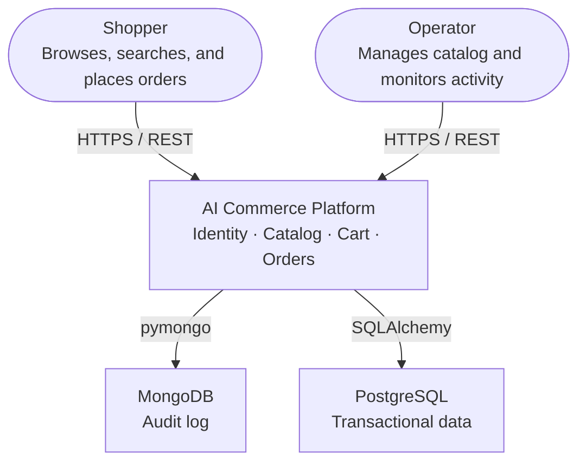
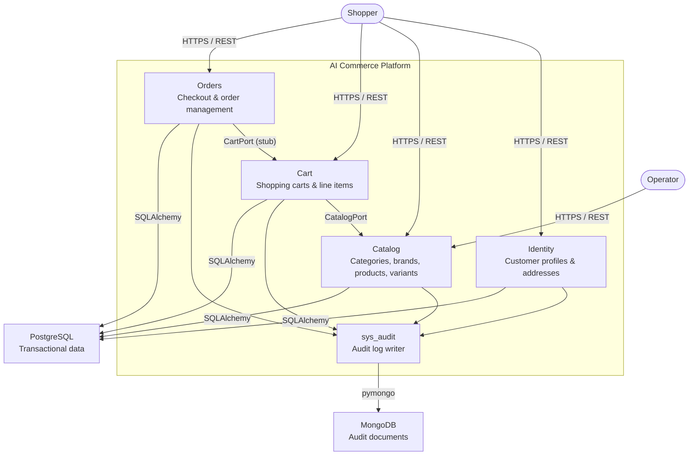
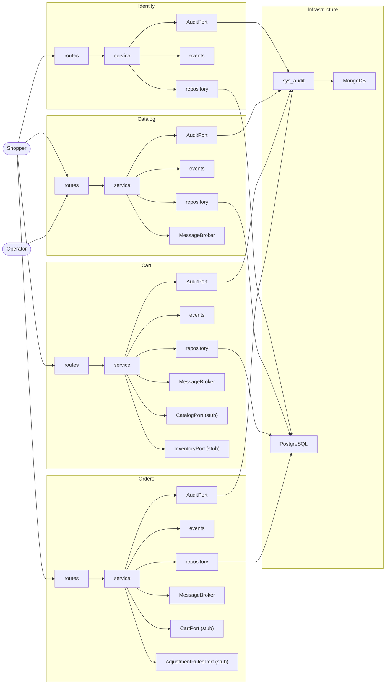

# Architecture

Implementation-level structural decisions for the AI Commerce Platform.

This document covers folder layout, module conventions, and shared layer boundaries.

Foundational architectural principles live in `docs/adr/`.
Developer workflow lives in `docs/development.md`.

---

## C4 Level 0 — System Context



---

## C4 Level 1 — Container Diagram



---

## C4 Level 2 — Component Diagram



---

## Project Structure

```
ai-commerce-platform/
├── app/
│   ├── identity/       # Customer profiles and addresses
│   ├── catalog/        # Product catalog
│   ├── cart/           # Shopping cart
│   ├── sys_audit/      # Audit log implementation
│   └── shared/
│       ├── api/
│       ├── audit_log/
│       ├── auth/
│       ├── config/
│       ├── db/
│       ├── events/
│       ├── observability/
│       └── storage/
├── docker/
│   └── postgres/       # Postgres init scripts
├── docs/
├── pyproject.toml
└── uv.lock
```

---

## Module Layout

Every domain module under `app/` follows this internal structure:

```
<domain>/
├── README.md
├── app.py          # create_app() factory — FastAPI app for this domain
├── container.py    # DeclarativeContainer — infrastructure singletons (audit, broker)
├── routes.py       # APIRouter with all endpoints and sentinel dependencies
├── schemas.py      # Pydantic request/response models
├── service.py      # Business logic
├── repository.py   # Database access
├── models.py       # SQLAlchemy models
├── exceptions.py   # Domain-specific exceptions extending shared base classes
├── events.py       # Domain event publishers
├── ports.py        # Abstract ports for external dependencies (optional)
└── adapters.py     # Concrete adapter implementations for ports (optional)
```

Not every file is required for every domain.

---

## Domain Conventions

- Each domain exposes a `create_app()` factory in `app.py`. A top-level entry point composes all domain apps for the monolith deployment.
- No domain may import from another domain's internals. Cross-domain data access goes through the owning domain's API or through events it publishes (ADR-001).
- Every domain must have a `README.md` describing its responsibility, owned data, published events, and consumed events.

---

## Shared Layer

`app/shared/` contains only platform infrastructure — no business logic. If a module in `shared/` starts depending on domain concepts (products, orders, customers), it belongs in a domain instead.

| Package | Responsibility |
| --- | --- |
| `api/` | Uniform response envelope, error schemas, pagination, validators (ADR-014) |
| `audit_log/` | Abstract audit port, `AuditRecord` schema, `record_audit()` helper, `NoOpAuditRepository` |
| `auth/` | JWT validation, auth middleware, token claims extraction |
| `config/` | Pydantic Settings base class, startup validation (ADR-015) |
| `db/` | SQLAlchemy engine, session factory, declarative base, mixins, generic repository |
| `events/` | Event envelope model, abstract `MessageBroker` port, `NoOpMessageBroker` |
| `exceptions.py` | Shared base exception classes (`ResourceNotFound`, `ResourceAlreadyExists`) |
| `observability/` | OpenTelemetry tracing setup, structured logging, `current_trace_id()` |
| `storage/` | Abstract `ObjectStorage` port (ADR-004) |

---

## Dependency Injection

Domains use `dependency-injector` (`DeclarativeContainer`) to manage infrastructure
singletons — `audit` and `broker` — that are shared across all requests within a
domain. Request-scoped objects (db session, services) remain under FastAPI's control.

Each domain's `routes.py` declares sentinel dependency functions (e.g. `_audit_dependency`,
`_broker_dependency`) that are never called directly. `app.py` overrides them at startup
via `app.dependency_overrides`, pulling resolved singletons from the container:

```python
container = CatalogContainer()
container.audit.override(MongoAuditRepository(mongo_settings))
app.dependency_overrides[_audit_dependency] = lambda: container.audit()
```

This keeps routes free of infrastructure construction logic and makes the wiring
explicit and testable — tests override the container with no-ops without touching
route code.

---

## Configuration

Each domain defines its own Pydantic Settings class. All domain settings are composed and validated at application startup. A missing or invalid configuration value causes startup to fail with an explicit error (ADR-015).

No domain may read environment variables directly outside of its Settings class.

---

## Migrations

Each domain has its own Alembic environment under `app/<domain>/migrations/`, with its own `env.py`, `alembic.ini`, and `versions/` directory. Migration histories are never shared across domains.

Each domain connects to its own PostgreSQL database (`commerce_<domain>`), provisioned automatically by `docker/postgres/init.sh` on container startup. This enforces data ownership (ADR-001) at the infrastructure level and ensures that extracting a domain into a separate service requires no database untangling.

All domain migration environments share a single `DATABASE_BASE_URL` (without the database name). Each `env.py` appends its own database name to build the full connection URL.

See `docs/development.md` for the migration workflow.
